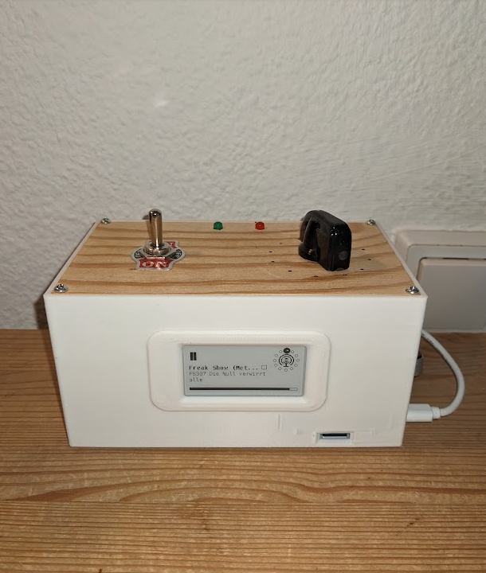
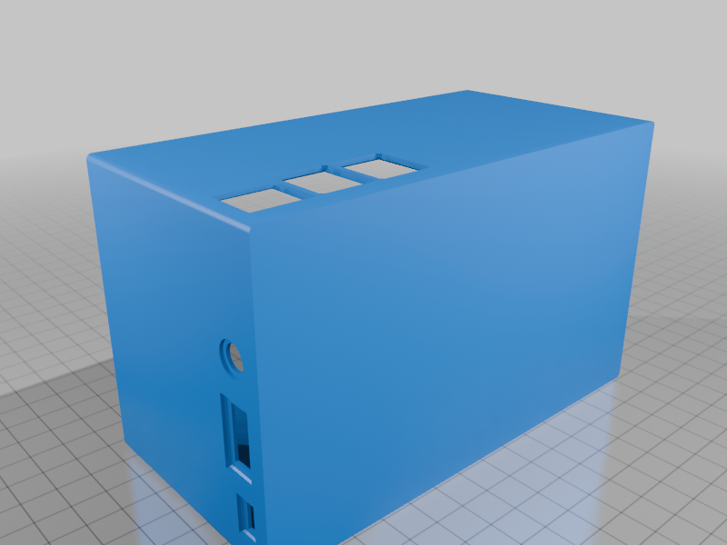
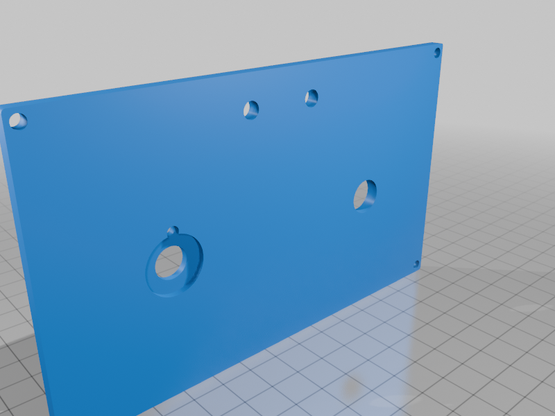
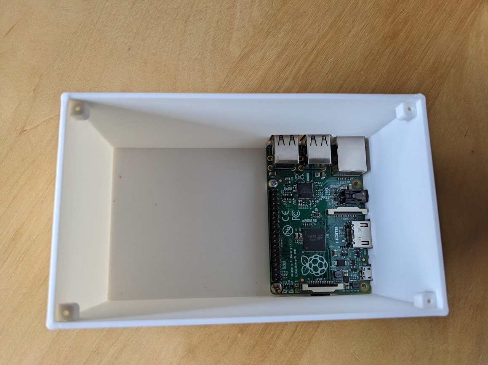
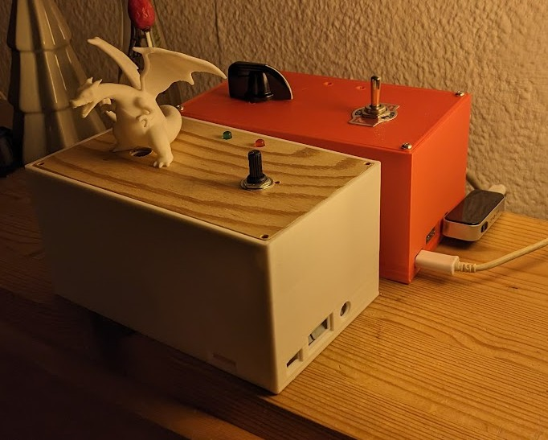
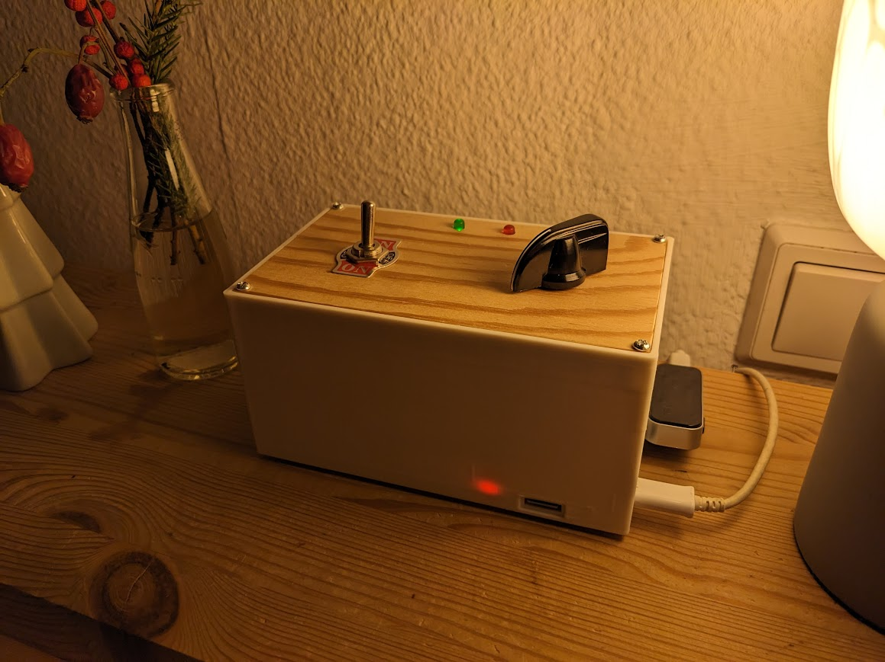

# Raspberry Pi Podcast Player

A reliable, minimalistic, hardware-controlled podcast and music player designed to run on Raspberry Pi.



## How it works

- A **12-position rotary knob** selects one of up to 12 podcast feeds (Podcast mode) or up to 12 album folders (Music mode).
- A **3-position mode switch** toggles between **Podcast / Paused / Music**.
- Playback position is **auto-saved**, so switching modes or rebooting resumes where you left off.
- Audio plays through **VLC → ALSA** out of the Pi's 3.5 mm jack.
- Two **status LEDs** show what the player is doing (green = playing or activity, red = warning/error).
- New podcast episodes are fetched **hourly**.
- An optional **Waveshare 2.13″ e-ink display** shows the current podcast/album, episode title, and a progress bar.


## Hardware

The player needs:

- A Raspberry Pi (3 B/B+, 2 B, or 1 B+)
- A 12-position rotary switch (one GPIO per position, active-low)
- A 3-position toggle switch for the mode
- Two LEDs (red + green) with current-limiting resistors
- _(Optional)_ a Waveshare 2.13″ V2/V3 e-ink HAT

See:

- **[HARDWARE.md](HARDWARE.md)** — full bill of materials (Pi model, switches, LEDs, e-ink, enclosure, wiring supplies)
- **[WIRING.md](WIRING.md)** — GPIO pin assignments for the rotary switch, mode switch, LEDs, and optional e-ink display

**Audio output:** My recommended setup is a 3.5 mm in-car FM transmitter plugged into the Pi's aux output, broadcasting to a nearby FM radio.

## Enclosure

A 3D-printed enclosure designed for this project. The enclosure includes a mounting point and port cutouts. The lid features cutouts for the 3-way switch, R26 turning knob, and two LEDs.

Download the STL files from **[Thingiverse](https://www.thingiverse.com/thing:7228464)**, or grab them from [`enclosure/`](enclosure/).

## Installation

1. **Clone the repository**

   ```bash
   git clone https://github.com/Timowa-crtl/podcast_player.git
   cd podcast_player
   ```

2. **Install system dependencies**

   ```bash
   sudo apt update
   sudo apt install vlc
   ```

3. **Install Python packages** (system-wide via apt)

   ```bash
   sudo apt install python3-requests python3-schedule python3-vlc python3-pil python3-rpi.gpio
   ```

   If `python3-schedule` is unavailable on your Raspberry Pi OS release, fall back to `sudo pip install schedule`.

4. **(Optional) E-ink display setup**
   - Enable SPI: `sudo raspi-config` → Interface Options → SPI → Enable
   - Install extras: `sudo apt install python3-spidev python3-numpy`
   - The `waveshare_epd` driver is vendored in this repo — no separate install needed.
   - If `PIL` or `waveshare_epd` is missing, the display is silently disabled and the rest of the player works normally.

## Configuration

Edit `config.json` to customize your podcasts, albums and settings.

## Usage

### Run the player

```bash
python3 main.py                  # start the player (Ctrl+C to stop)
```

### Inspect state

```bash
python3 status.py
```

### Hardware smoke tests

Run these directly on the Pi to verify wiring:

```bash
python3 hardware.py          # poll the rotary + mode switch, prints state to stdout
python3 led_controller.py    # cycle through every LED state
```

## Autostart with systemd

To run the player on boot, create a systemd service. Replace `<your-user>` with your Linux username (e.g. `pi`).

1. Create `/etc/systemd/system/podcast.service` with:

   ```ini
   [Unit]
   Description=Podcast Player
   After=network.target

   [Service]
   ExecStart=/usr/bin/python3 -u /home/<your-user>/podcast_player/main.py
   WorkingDirectory=/home/<your-user>/podcast_player
   User=<your-user>
   Restart=always

   StandardOutput=append:/home/<your-user>/podcast_player/podcast.log
   StandardError=append:/home/<your-user>/podcast_player/podcast.log

   [Install]
   WantedBy=multi-user.target

   ```

2. Reload systemd:

   ```bash
   sudo systemctl daemon-reload
   ```

3. Enable autostart:

   ```bash
   sudo systemctl enable podcast.service
   ```

4. Start service:

   ```bash
   sudo systemctl start podcast.service
   ```

5. View logs:

   ```bash
   tail -f ~/podcast_player/podcast.log
   ```

## Gallery






